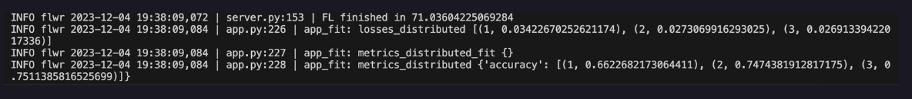

<p align="center">
    
</p>


# Fedkube

Extending Columbia's [PrivateKube](https://github.com/columbia/PrivateKube) with Federated Learning.

> **Click the brain and lock emojis for Presentation Link: [🧠🔒](https://www.canva.com/design/DAF13GlF3q4/4UoCB074ejB5735HfmL7mw/view?utm_content=DAF13GlF3q4&utm_campaign=designshare&utm_medium=link&utm_source=editor)**

## Getting Started with Fedkube

### Obtaining the Amazon Reviews Product Classication Data

1. `cd code`
2. `mkdir data`
3. `touch reviews.h5`
4. `python3 dataset.py getmini`
5. `python3 convert_h5dataset_to_text.py`

The instructions convert `reviews.h5` to `reviews.jsonl` data, which will be used by the Federated Learning code below.

### Run the Federated Learning with Privacy Budget

We tested the code on Brown's CCV compute cluster (`gpu-he`) with 6 V100 GPUs on Dec 8, 2023 using Python 3.9.0. Here's the following instructions:

1. Calls interactive 6 GPUs with 50GB CPU memory (for 4 hours). We need the interactive mode for ease of launching server and clients.

    `interact -q gpu-he -g 6 -m 50g -n 4 -t 4:00:00` 

2. Set up virtual environment. 

    ```
    python3 -m venv env
    pip3 install -r requirements.txt
    source env/bin/activate
    ```

3. Use `screen` to launch global server. Here the server would select 2 clients at each round of training and evaluation out of 10 total clients.

    ```bash
    screen -S server

    # inside screen
    python3 fedlearn/dpfedavgfixed_hf_server.py \
        --num_to_sample 2 \
        --total_clients 10
    ```

4. Exit the screen and use `screen` to launch different clients. Here, we set up the first client. Once all 10 clients are set up, the server will then begin federated learning with 3 rounds of training.

    ```bash
    screen -S client1

    # inside screen
    python3 fedlearn/hf_clients.py \
        --total_clients 10 \
        --client_idx 0 \
        --total_training_rounds 3 \
        --amazon_reviews_jsonl_path PATH_TO_DATA \
        --privacy_configs_csv_path fedlearn/clients_budget_demand.csv
    ```

5. You should be able to obtain result that shows the accuracy after each round of training. For instance, here it shows 75.11 at the end of the third round of federated learning.

    
